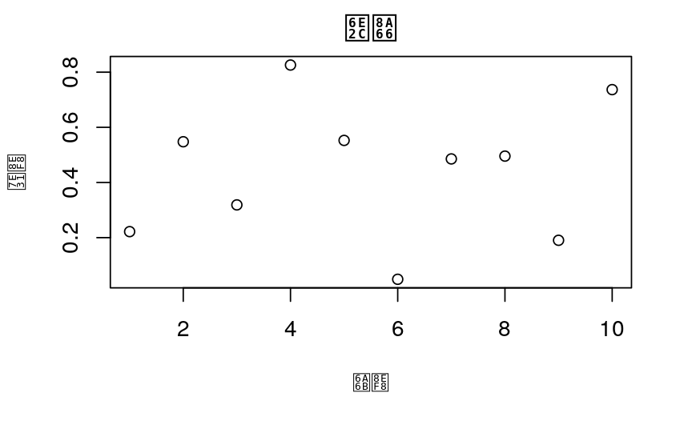
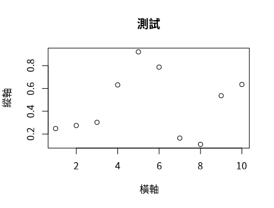

在RStudio的圖表中使用中文字體
================
2022-07-07

在RStudio中，要在圖型中增加中文字型，以避免圖中出現亂碼問題。

### 先確認預設環境

1.  在RConsole輸入 `Sys.getlocale()` ，結果如下表示為英文語系。

<!-- -->

    [1] "LC_CTYPE=en_US.UTF-8;LC_NUMERIC=C;LC_TIME=en_US.UTF-8;LC_COLLATE=en_US.UTF-8;LC_MONETARY=en_US.UTF-8;LC_MESSAGES=en_US.UTF-8;LC_PAPER=en_US.UTF-8;LC_NAME=C;LC_ADDRESS=C;LC_TELEPHONE=C;LC_MEASUREMENT=en_US.UTF-8;LC_IDENTIFICATION=C"

2.  以plot繪圖，會發現中文呈現亂碼

``` r
plot(runif(10), xlab = "橫軸", ylab = "縱軸", main = "測試")
```

<figure>

<figcaption>中文字型無法顯示</figcaption>
</figure>

### 於`Home`目錄增加`.Rprofile`檔

在Home目錄下新增`.Rprofile`檔，增加以下內容：

``` r
Sys.setlocale(category = "LC_ALL", locale = "zh_TW.UTF-8")
```

### 安裝中文字型

在Linux環境中，可以使用`fc-list`查詢可用的字型

    /usr/share/fonts/truetype/dejavu/DejaVuSerif-Bold.ttf: DejaVu Serif:style=Bold

    /usr/share/fonts/truetype/dejavu/DejaVuSansMono.ttf: DejaVu Sans Mono:style=Book

    /usr/share/texmf/fonts/opentype/public/tex-gyre/texgyrebonum-bold.otf: TeX Gyre Bonum:style=Bold

    /usr/share/texmf/fonts/opentype/public/tex-gyre/texgyrecursor-italic.otf: TeX Gyre Cursor:style=Italic

    /usr/share/texmf/fonts/opentype/public/tex-gyre/texgyretermes-italic.otf: TeX Gyre Termes:style=Italic

    /usr/share/fonts/type1/gsfonts/n021024l.pfb: Nimbus Roman No9 L:style=Medium Italic

    ...[略]...

若要安裝新字型

1.  先以`root`身份登入，在`/usr/share/fonts`建立一個新目錄，如`myfonts`。
2.  將欲安裝字型置於該目錄之下。
3.  執行`fc-cache -v /usr/share/fonts/myfonts`，以安裝字型。
4.  再以`fc-list`確認是否已經安裝。

### 也可使用`showtext`套件，安裝字型

1.  安裝`showtext`套件，`install.packages('showtext')`

2.  啟用套件，`library(showtext)`

3.  Google提供的字型列表：`font_families_google()` ，其中`Noto Sans TC`
    為思源黑體(<https://fonts.google.com/noto/specimen/Noto+Sans+TC>)

        ...[略]... 
         [897] "Noto Sans Symbols"                
         [898] "Noto Sans Symbols 2"              
         [899] "Noto Sans Syriac"                 
         [900] "Noto Sans TC"                     
         [901] "Noto Sans Tagalog"                
         [902] "Noto Sans Tagbanwa"               
        ...[略]...

4.  安裝思源黑體，`font_add_google("Noto Sans TC", "NotoSansTC")`

5.  確認安裝的字體，`font_families()` ，安裝成功！

        [1] "sans"         "serif"        "mono"         "wqy-microhei"
        [5] "NotoSansTC"

6.  啟動showtext，`showtext_auto(enable=TRUE)`

7.  指定字體，`par(family = 'NotoSansTC')`

8.  再次以`plot`繪圖，成功顯示中文字！

    ``` r
    plot(runif(10), xlab = "橫軸", ylab = "縱軸", main = "測試")
    ```

    
